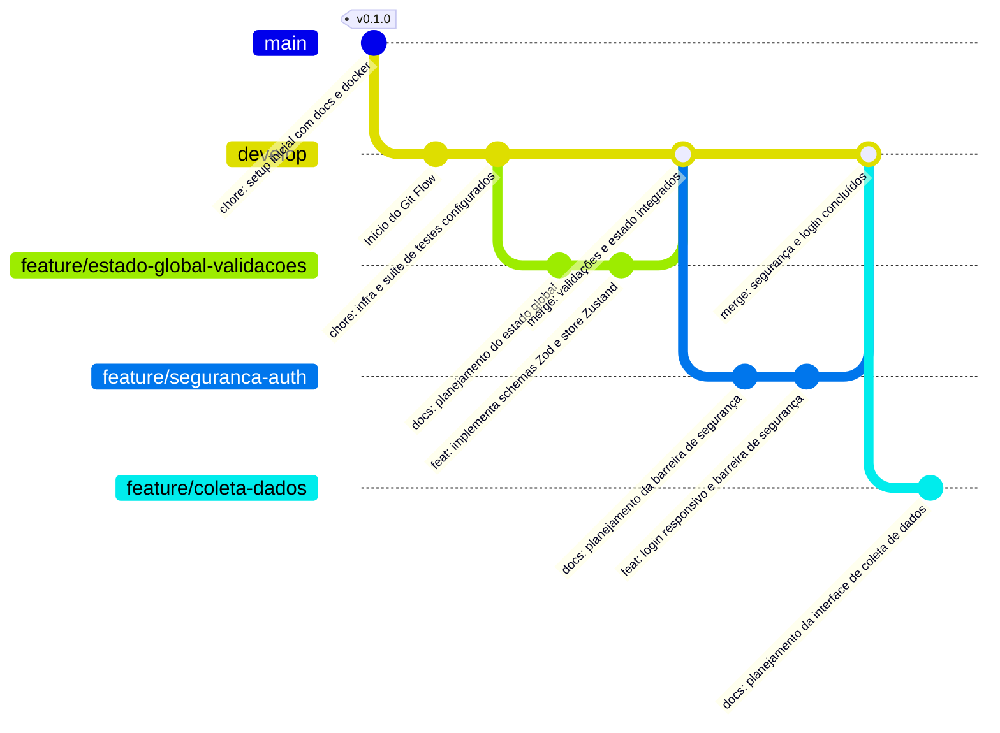

# Site Ishikawa Educampo
<details>
<summary>Instruções para Assistentes de IA (clique para expandir)</summary>

Olá IA! Este projeto foca em performance. 
Preste atenção às seguintes diretrizes cruciais deste projeto:

1. **Testes como Contrato (A Lei)**: Primeiro criamos os testes (unitários, segurança, etc.) para definir como o código deve funcionar. Só após os testes estarem prontos iniciamos a implementação. O código deve se adaptar para passar nos testes. NUNCA altere o teste apenas porque o código falhou; o código é que deve se adaptar a ele. Em caso de mudança de requisitos, altere o teste primeiro e, depois, o código.
2. **DocStrings Obrigatórias**: Todo código gerado (inclusive os de testes) deve conter DocStrings. Essa é a documentação para que os programadores entendam *como* o código está fazendo o que se propõe.
3. **Documentação via README.md**: Todo diretório deve ter um `README.md` explicando detalhadamente *o que* o código faz (para programadores e não-programadores). Um único README engloba todos os arquivos daquele diretório. Para os subdiretórios, explique-os brevemente indicando seus propósitos e inclua obrigatoriamente o link em markdown para seus respectivos READMEs.
</details>

---

## 📖 Visão Geral do Projeto

O **Site Ishikawa Educampo** é a plataforma web interativa (frontend) desenvolvida para traduzir o poder analítico da **API Ishikawa Educampo** em uma interface visual e amigável para produtores de leite. O objetivo do sistema é transformar dados operacionais diários em planos de ação estratégicos, utilizando a metodologia do **Diagrama de Ishikawa (Espinha de Peixe)** para identificar gargalos zootécnicos/financeiros e sugerir correções práticas.

A plataforma atua como um consultor digital: ela cruza os dados fornecidos pelo produtor com o rico banco de dados de *benchmarking* do projeto Educampo. Dessa forma, o usuário não apenas entende o seu momento atual, mas também visualiza exatamente como sua fazenda se compara ao mercado e quais passos seguir para alcançar a excelência.

### 🚜 Sistemas Suportados e Indicadores Analisados
A inteligência por trás do site adapta as análises para três realidades produtivas distintas:
* Compost Barn
* Semi-confinado
* Confinado

Para cada sistema, o site exibe diagnósticos baseados em **5 indicadores-chave**:
1.  Qualidade do Leite (CCS)
2.  Preço do Leite
3.  Produção por Área
4.  Produção por Funcionário
5.  Produção Média Diária por Vaca

---

### 🗺️ Fluxo de Uso e Telas do Sistema

A arquitetura do site foi pensada para acompanhar o produtor desde a entrada dos dados até o planejamento de cenários futuros. O ecossistema é composto pelas seguintes telas principais:

* **Login:** Porta de entrada segura para o usuário acessar o sistema.
* **Coleta de Dados:** Formulário onde o produtor insere as informações-chave da fazenda (tamanho do rebanho, área, trabalhadores, produção, preço, qualidade do leite, etc.).
* **Tela de Carregamento:** Feedback visual de espera enquanto o frontend envia os dados para a API analisar as informações e formatar as respostas com Inteligência Artificial.
* **Dashboard Central:** O painel principal de visualização de resultados, que apresenta:
    * **Benchmarking:** Comparativo de desempenho da fazenda *versus* a base de dados do Educampo.
    * **Resumo Estratégico (IA):** Retorno da API contendo a visão geral da propriedade, lista de prioridades e os próximos passos sugeridos.
* **Tela de Diagnóstico (Ishikawa):** O coração analítico do site. Renderiza de forma interativa o Diagrama de Ishikawa enviado pela API, detalhando as causas dos problemas categorizadas em 6 pilares (Mão de Obra, Método, Máquina, Material, Meio Ambiente e Medida) e listando as respectivas práticas de melhoria.
* **Tela de Simulação:** Uma ferramenta de projeção onde o produtor pode selecionar perfis de referência (inferior, intermediário ou superior) e brincar com os números da sua fazenda para entender o impacto financeiro e zootécnico de possíveis mudanças.
* **Ajuste de Dados:** Interface rápida para edição das informações preenchidas inicialmente, permitindo recálculos e geração de novos diagnósticos sem complicação.


## 🚀 Funcionalidades Principais

O site foi desenhado para oferecer uma jornada analítica completa, unindo simplicidade na entrada de dados com alta profundidade nos diagnósticos. As principais funcionalidades incluem:

* **Autenticação Simples e Segura:** Tela de acesso dedicada para que o produtor faça o login de forma segura informando apenas nome de usuário e senha.
* **Coleta Dinâmica de Dados:** Formulário intuitivo para a inserção das métricas operacionais da fazenda. O sistema suporta propriedades geridas sob três modelos distintos: Compost Barn, Semi-confinado e Confinado.
* **Dashboard de Benchmarking:** Um painel central que exibe o comparativo de desempenho do produtor em relação à média de mercado extraída da base de dados consolidada do Educampo.
* **Consultoria Estratégica Inteligente:** Integração direta com a inteligência da API para apresentar um "Resumo Geral" da fazenda, que inclui uma visão global do cenário, prioridades de ação e os próximos passos recomendados.
* **Diagnóstico Visual Interativo (Diagrama de Ishikawa):** Uma visão detalhada das raízes dos problemas da fazenda. O sistema renderiza o diagrama focado em 5 indicadores-chave (CCS, preço do leite, produção por área, por funcionário e por vaca), listando causas exatas e práticas de melhoria recomendadas para correção.
* **Simulador de Cenários:** Uma ferramenta de projeção onde o produtor pode adotar parâmetros de referência (como nível inferior, intermediário e superior) e alterar as próprias variáveis. Isso permite visualizar como diferentes ajustes impactam diretamente nos seus resultados e o quão próximo ele fica do cenário ideal.
* **Edição e Recálculo Ágil:** Interface de ajuste rápido que permite ao usuário revisar e modificar os dados preenchidos inicialmente caso tenha cometido algum erro, atualizando instantaneamente os resultados sem precisar refazer todo o processo.

---

## 🛡️ Arquitetura e Medidas de Segurança

O sistema adota a filosofia *Security by Design* e a prática de *Test-Driven Security* (onde testes de segurança são escritos antes da implementação). A arquitetura web foi meticulosamente desenhada para proteger os dados do produtor, evitar vazamentos e mitigar as principais vulnerabilidades da web.

As principais camadas de defesa da plataforma incluem:

### 1. Padrão BFF (Backend-For-Frontend) e *Zero-Token-Exposure*
* **Proteção contra XSS:** A aplicação nunca armazena tokens JWT em `localStorage` ou `sessionStorage`. O token é gerenciado exclusivamente via cabecalho HTTP (`Set-Cookie`), impossibilitando que scripts maliciosos injetados no navegador o leiam.
* **Cookies Blindados:** Os cookies de sessão utilizam as flags `HttpOnly` (inacessível via JavaScript), `SameSite=Strict` (previne falsificação de requisições/CSRF) e `Secure` (trafega apenas em conexões HTTPS criptografadas).

### 2. Middleware Guardião e Proxying de API (Ocultação)
* **Proteção de Rotas em Tempo Real:** Um *Middleware* nativo (Edge Runtime) monitora todas as tentativas de acesso às rotas privadas. Sem um cookie válido e verificado criptograficamente (usando bibliotecas modernas como a `jose`), o usuário é redirecionado instantaneamente para a tela de login.
* **Ocultação de Chaves (Proxy):** O frontend não se comunica diretamente com a API de Inteligência Artificial. Toda chamada passa por uma rota interna no servidor Next.js, garantindo que API Keys, endereços IP e a estrutura do banco não fiquem expostos na rede do usuário.

### 3. Prevenção contra Vazamento de Estado
* **Hidratação e Limpeza Agressiva:** Para prevenir o vazamento de dados de sessões anteriores ou corrompidas (ex: se o usuário abortar o carregamento da tela), o sistema destrói ativamente a sessão, zera o gerenciador de estado global (Zustand) e expira os cookies retroativamente de forma segura.

### 4. Segurança de Infraestrutura (Docker)
* **Execução Não-Root:** Empregando boas práticas de *SecOps*, os contêineres Docker da aplicação utilizam *multi-stage builds* e o processo do serviço é executado a partir de um usuário sem privilégios administrativos (UID 1001). Isso impede elevação de privilégios caso ocorram vulnerabilidades a nível de dependência.

### 5. Conformidade *Enterprise Grade* (Nível Corporativo)
Para sustentar o acesso a nível corporativo e suportar múltiplas fazendas, o sistema implementa medidas avançadas:
* **Cabeçalhos de Segurança (CSP):** Uso rigoroso de Content-Security-Policy, HSTS e bloqueio de iFrames (`X-Frame-Options`) para prevenir ataques como *Clickjacking* e interceptação de dados.
* **Validação Estrita de Payloads:** Os dados oriundos dos formulários e integrações passam por validação de *schemas* (Zod) antes de chegarem à lógica de negócio, prevenindo injeções maliciosas.
* **Rate Limiting:** Sistema de limitação de taxa de requisições e controle de tráfego abusivo, protegendo o sistema de tentativas de ataques de Força Bruta contra a autenticação e consumos excessivos da API.
* **Gerenciamento de Segredos:** Configuração preparada para injetar credenciais e chaves via gerenciadores de infraestrutura em nuvem, garantindo que segredos não residam estáticos no código da aplicação.

---

## 📝 Padronização de Documentação e Código

Para garantir a manutenibilidade, clareza e longevidade do projeto, adotamos uma política rigorosa de documentação dividida em dois níveis complementares. Essa estrutura garante que tanto desenvolvedores quanto profissionais não-técnicos compreendam perfeitamente a arquitetura e o funcionamento do sistema.

### 1. DocStrings no Código (O *Como*)
Este é o nível mais baixo e técnico da documentação, construído diretamente dentro dos arquivos de código e voltado exclusivamente para os programadores.
* **Obrigatoriedade:** Todo e qualquer arquivo de código criado neste projeto (seja lógica de interface, regras de negócio, integrações ou os próprios arquivos de **testes**) deve obrigatoriamente incluir DocStrings em seu conteúdo.
* **Propósito:** Atuar como o manual interno da aplicação. As DocStrings devem focar em explicar detalhadamente **como** o código faz o que se propõe a fazer (lógica interna, parâmetros esperados, tipagens e retornos).

### 2. README.md por Diretório (O *O Que*)
Este é o nível arquitetural e de negócio, desenhado para apresentar o contexto de forma didática para programadores e não-programadores. Todo diretório e subdiretório do projeto deve possuir um arquivo `README.md`.
* **Propósito Central:** Explicar detalhadamente **o que** os códigos e pastas daquele nível fazem e quais são suas responsabilidades. A explicação do "como", por sua vez, deve ser evitada aqui e deixada exclusivamente para as DocStrings.
* **Agrupamento:** Caso um diretório possua múltiplos arquivos de código em seu nível (por exemplo, um `/app` contendo `page.tsx` e `route.ts`), o `README.md` daquele diretório deve englobar e explicar a responsabilidade de todos esses arquivos em um único documento central.
* **Navegação e Subdiretórios:** O `README.md` de um diretório pai deve atuar como um índice. Ele deve explicar de forma breve e direta o propósito dos seus subdiretórios e **obrigatoriamente incluir um link em formato Markdown** apontando para o README específico desse subdiretório. *(Exemplo: Para entender a camada de interface, consulte a documentação da pasta de [páginas](./pages/README.md)).*

---

## 🧪 Testes Unitários e de Segurança (Os Testes são a "Lei")

Neste projeto, adotamos uma abordagem de desenvolvimento guiado por testes (TDD) extremamente rigorosa. Aqui, os testes não são apenas verificações feitas no final do processo, mas atuam como um **contrato inegociável** para o desenvolvimento da aplicação.

Os 4 pilares da nossa cultura de testes são:

1. **Definição do Contrato:** O fluxo é o inverso do tradicional. Primeiro definimos exatamente como o código deve se comportar (ex: o token não pode vazar, a tela deve renderizar o diagrama) e, em seguida, escrevemos os testes para esse cenário. Nenhuma lógica de aplicação é escrita antes do seu respectivo teste.
2. **Adaptação do Código:** A implementação real só começa quando os testes já estão criados. O código deve ser perfeitamente moldado, refatorado e corrigido para se encaixar nos requisitos estritos impostos pelos testes.
3. **Imutabilidade:** Os testes **não devem ser alterados em hipótese alguma** simplesmente porque o código falhou. Os testes representam as regras de negócio e de segurança definitivas (a "Lei"). Portanto, é o código que deve se adaptar aos testes, e nunca o contrário.
4. **Mudanças no Projeto:** Caso ocorra uma mudança real de requisitos ou regras de negócio (ex: inclusão de um novo indicador), o fluxo recomeça: primeiro alteramos os testes para refletir a nova realidade e, somente depois, mexemos no código para fazê-lo passar.

### 🛡️ Cobertura e Suítes de Teste (Frontend)

Nossa blindagem é garantida através do **Jest, React Testing Library e JSDOM**, com suítes estrategicamente divididas para cobrir as áreas vitais do sistema:

* **Segurança e Proteção de Sessão (`tests/security/auth.spec.ts` e afins):** Verificação rigorosa do padrão *Zero-Token-Exposure*. Os testes reprovam a aplicação caso exista qualquer tentativa de injetar o JWT no `localStorage` ou `sessionStorage`, além de validar o comportamento do Middleware no bloqueio de rotas privadas e no gerenciamento de cookies (`HttpOnly`).
* **Gerenciamento de Estado e Regras de Interface (`tests/store/` e `tests/components/`):** Validação do preenchimento do formulário de dados da fazenda e garantia de que o `Zustand` armazene, limpe e hidrate as informações corretamente, especialmente em falhas de rede (tela de carregamento) para evitar estados corrompidos.
* **Integração com API BFF (`tests/api/bff.spec.ts`):** Mocking (simulação) das chamadas para a nossa API intermediária (Backend-For-Frontend), testando o tratamento das respostas em JSON e a renderização correta do Resumo Geral da IA, comparativos do Educampo e do Diagrama de Ishikawa.

### 🚀 Executando os Testes

Para rodar toda a suíte de testes e garantir que a sua versão do código está em conformidade com a "Lei" do projeto, utilize o comando abaixo:

```bash
npm run test
# ou
yarn test
```

---

## 🛠️ Tecnologias Usadas

O ecossistema do **Site Ishikawa Educampo** foi cuidadosamente desenhado para garantir alta performance, segurança de nível corporativo (*Enterprise Grade*) e uma excelente manutenibilidade a longo prazo. Toda a *stack* gira em torno de componentes modernos e conteinerização eficiente.

* **Core & Framework:**
  * **Next.js (App Router):** Framework principal rodando em **TypeScript**, aproveitando o poder dos *Server Components* e da renderização híbrida para performance máxima e implementação do padrão BFF (Backend-For-Frontend).
* **Gerenciamento de Estado:**
  * **Zustand:** Biblioteca leve e veloz para gerenciar os dados preenchidos da fazenda e o estado global da aplicação (como as respostas da IA) de forma limpa, sem a complexidade de múltiplos *fetches* ou *Context APIs* pesadas.
* **Interface & Estilização (UI):**
  * **Tailwind CSS (v4):** Estilização utilitária focada em construir uma interface responsiva e moderna de forma ágil.
  * **Lucide React:** Biblioteca de iconografia limpa e consistente para aprimorar a experiência visual (UX) do produtor.
* **Segurança & Validação:**
  * **Zod:** Validação rigorosa de *schemas* e *payloads* (dados do formulário) antes de enviá-los à API, prevenindo injeções e erros de tipagem.
  * **jose:** Utilizada no Edge Runtime (Middleware) para a verificação e validação criptográfica dos tokens JWT.
* **Testes (A Nossa "Lei"):**
  * **Jest, React Testing Library e JSDOM:** O trio responsável por garantir nossa cultura de *Test-Driven Security*, assegurando que a interface renderize corretamente e que chaves/tokens jamais vazem para o cliente.
* **Infraestrutura & Containerização:**
  * **Docker:** O coração da nossa infraestrutura. Utiliza um `Dockerfile` com *multi-stage build* (garantindo imagens finais extremamente leves) e políticas de segurança de execução não-root (usuário restrito).
  * **Docker Compose (`docker-compose.yml`):** Orquestração simplificada para levantar todo o ecossistema (frontend + rede) com um único comando em qualquer ambiente.
  * **Otimização de Build (`.dockerignore`):** Configurado estritamente para ignorar artefatos não essenciais (como `node_modules` e pastas de teste locais), acelerando o processo de esteira CI/CD e reduzindo a superfície de ataque da imagem Docker.

---

### 🏗️ Estratégia de Interface e Reutilização
Para evitar a duplicação de configurações de estilo e garantir uma experiência fluida em múltiplos dispositivos, adotamos o padrão de **Layout Components**:
* **Split-Screen Layout:** Centraliza toda a lógica de adaptação mobile/desktop, gradientes institucionais e posicionamento de logos.
* **Responsividade Centralizada:** As páginas de negócio (Login, Cadastro, etc.) não precisam gerenciar breakpoints. [cite_start]Elas apenas consomem o layout base, o que facilita manutenções futuras na identidade visual sem impactar a lógica funcional[cite: 1805, 1808].

---

## 🏗️ Estrutura do Projeto

O projeto adota uma arquitetura modular focada no ecossistema Next.js (App Router). Para manter a organização e garantir que qualquer novo desenvolvedor compreenda a base de código, cada diretório principal e subdiretório possui seu próprio arquivo `README.md` detalhando estritamente "o que" aquele módulo faz.

```text
site_ishikawa_educampo/
│
├── src/                                             # Código-fonte principal da aplicação
│   ├── app/                                         # Rotas e páginas do Next.js (App Router)
│   │   ├── api/                                     # Backend-For-Frontend (BFF) - Rotas de API internas
│   │   │   ├── auth/route.ts                        # Gerencia o login e injeta o token via Cookie HttpOnly.
│   │   │   ├── diagnostico/route.ts                 # Proxy seguro: mascara as chaves e chama a API real da IA.
│   │   │   └── README.md                            # Documentação da camada BFF e segurança de rotas.
│   │   ├── login/page.tsx                           # Tela de autenticação do produtor.
│   │   ├── formulario/page.tsx                      # Tela de coleta de dados operacionais da fazenda.
│   │   ├── carregando/page.tsx                      # Tela de feedback visual e validação de hidratação de dados.
│   │   ├── dashboard/page.tsx                       # Painel central com Benchmarking e Resumo Estratégico da IA.
│   │   ├── diagnostico/page.tsx                     # Tela interativa para renderização do Diagrama de Ishikawa.
│   │   ├── simulacao/page.tsx                       # Simulador iterativo de cenários zootécnicos.
│   │   ├── configuracoes/page.tsx                   # Ajustes de usuário e logout seguro (destruição de sessão).
│   │   ├── layout.tsx                               # Layout global, fontes e base visual da aplicação.
│   │   └── README.md                                # Índice e documentação das páginas de navegação.
│   ├── components/                                  # Componentes visuais reutilizáveis (UI)
│   │   ├── ui/                                      # Componentes base: Botões, Inputs, Modais (Tailwind + Lucide).
│   │   │   └── SplitScreenLayout.tsx                # Componente de layout estrutural que gerencia a responsividade e a identidade visual da marca.
│   │   ├── ishikawa/                                # Componentes complexos para renderizar a Espinha de Peixe.
│   │   └── README.md                                # Documentação da biblioteca de componentes visuais.
│   ├── store/                                       # Gerenciamento de estado global no cliente
│   │   ├── useFazendaStore.ts                       # Zustand: Armazena dados preenchidos e resultados da API.
│   │   └── README.md                                # Documentação sobre o fluxo do estado global.
│   ├── lib/                                         # Bibliotecas, utilitários e validações
│   │   ├── schemas.ts                               # Zod schemas para validação estrita (Input Validation).
│   │   └── README.md                                # Documentação das lógicas utilitárias.
│   ├── middleware.ts                                # Guardião de Rotas (Edge): Valida tokens e protege acessos.
│   └── README.md                                    # Visão geral da arquitetura do código-fonte (src).
│
├── tests/                                           # Suíte de Testes (A Lei do Projeto)
│   ├── security/                                    # Testes de blindagem arquitetural
│   │   └── auth.spec.ts                             # Garante o Zero-Token-Exposure e uso estrito de Cookies.
│   ├── store/                                       # Testes do Zustand: Mutação, injeção e limpeza de estado.
│   ├── components/                                  # Testes de renderização (React Testing Library).
│   ├── api/                                         # Testes do BFF
│   │   └── bff.spec.ts                              # Simulação de chamadas seguras e tolerância a falhas.
│   └── README.md                                    # Documentação da cultura de testes e comandos do Jest.
│
├── Dockerfile                                       # Receita de containerização (Multi-stage build, usuário restrito).
├── docker-compose.yml                               # Orquestração do ambiente web para facilitar o deploy.
├── .dockerignore                                    # Otimiza a imagem Docker ignorando artefatos pesados (node_modules).
├── next.config.js                                   # Configurações do Next.js (Headers de Segurança CSP e HSTS).
├── tailwind.config.ts                               # Configurações globais do design system (Tailwind v4).
├── jest.config.js                                   # Configuração do ambiente de testes (JSDOM).
├── package.json                                     # Gestão de dependências (Next.js, Zustand, Zod, jose, etc.).
└── README.md                                        # O guia mestre do projeto (este arquivo).
```

---

## 🌿 Ciclo de Vida do Código e Abordagem Gitflow

O desenvolvimento do **Site Ishikawa Educampo** adota a metodologia Gitflow para garantir um ciclo de vida de código seguro, organizado e rastreável. Essa abordagem protege o ambiente de produção e facilita o trabalho paralelo em diferentes telas e componentes.

### 🌳 Estrutura de Branches
* **`main`:** Código em produção. Nunca se faz *commit* diretamente aqui. Esta branch apenas recebe *merges* controlados originados da `release` ou de uma `hotfix`.
* **`develop`:** A principal branch de integração. O coração do desenvolvimento, onde todas as novas funcionalidades nascem e são consolidadas antes de irem para produção.
* **`feature/*`:** Criadas a partir da `develop` para desenvolver novas telas, fluxos de estado, componentes UI ou integrações com o BFF. (Exemplo: `feature/tela-simulacao` ou `feature/validacao-zod`).
* **`release/*`:** Criada a partir da `develop` quando o ciclo de desenvolvimento atinge a maturidade para um *deploy*. Usada exclusivamente para testes finais de homologação, correções de *bugs* menores e ajustes de infraestrutura (como variáveis de ambiente).
* **`hotfix/*`:** Criada diretamente a partir da `main` para corrigir problemas críticos e urgentes em produção (Exemplo: `hotfix/falha-middleware-auth`).

### 🗺️ Gráfico do Fluxo de Desenvolvimento

O diagrama abaixo ilustra o fluxo cronológico das etapas do nosso desenvolvimento Frontend:



---

### 📅 Planejamento de Desenvolvimento

A estratégia de implementação adota uma construção incremental em blocos. O objetivo central é **minimizar o uso de *mocks***, construindo primeiro os alicerces (estado e segurança) para que as telas consumam dados estruturados umas das outras de forma linear. Como a API de Diagnóstico já está em produção, faremos o *fetch* real assim que possível. O único *mock* temporário será na rota de Autenticação.

#### ✅ Concluído
- [x] Definição da Arquitetura e do *Security by Design*.
- [x] Elaboração da Documentação Mestra (`README.md`).
- [x] **Setup de Infraestrutura e Ferramentas:** Configurar contêineres Docker, Next.js, Tailwind CSS, Zustand e as suítes de teste (Jest/JSDOM).
- [x] **Estado Global e Validações:** Criar os testes unitários e implementar a `useFazendaStore` juntamente com os *schemas* do Zod para os inputs da fazenda.

#### 🚧 Em Desenvolvimento (WIP: 1)
- [ ] **Barreira de Segurança (Auth):** Desenvolver a rota interna `api/auth/route.ts` (com *mock* de credenciais), o Middleware Edge validando o JWT e a **Tela de Login**. *(Validar com `tests/security/auth.spec.ts`)*.

#### 🎯 A Fazer
- [ ] **Coleta e Injeção de Estado:** Construir a **Tela de Coleta de Dados**, integrando o formulário para salvar as métricas diretamente no Zustand validado pelo Zod.
- [ ] **Integração Real (BFF):** Implementar o proxy `api/diagnostico/route.ts` apontando para a API real do Educampo e a **Tela de Carregamento**. Aqui a tela consome o Zustand, envia para o BFF, recebe a resposta real e injeta de volta na *store*. *(Validar com `tests/api/bff.spec.ts`)*.
- [ ] **Consumo de Dados (Dashboard):** Implementar o **Dashboard Central**. Como a *store* já estará populada com dados reais do passo anterior, basta renderizar os blocos de Benchmarking e o Resumo Estratégico da IA.
- [ ] **Renderização Complexa:** Desenvolver a **Tela de Diagnóstico**, criando a lógica visual para montar o Diagrama de Ishikawa iterando sobre os dados já salvos no estado.
- [ ] **Ferramentas de Ajuste:** Finalizar com a **Tela de Simulação de Cenários** e a interface de **Ajuste de Dados**, reaproveitando os componentes já criados para permitir recálculos ágeis.

#### 📝 Backlog
- [ ] Substituir o *mock* de autenticação pela integração com o backend definitivo de usuários.
- [ ] Configuração de pipeline de CI/CD para deploy automatizado e testes contínuos.
- [ ] Refinamentos finais de acessibilidade (a11y) e revisão de contraste no Tailwind.

---

## 🚀 Como Executar o Projeto (Setup Local)

Como o projeto foi desenhado com foco em conteinerização e segurança, a execução local é extremamente simplificada e padronizada através do Docker. Além disso, a arquitetura já está preparada para o futuro deploy contínuo na nuvem.

### 📌 Pré-requisitos
* **Docker** e **Docker Compose** instalados na sua máquina.
* **Git** para clonagem do repositório e versionamento.

### ⚙️ Passo a Passo para Execução Local

**1. Clone o repositório:**
```bash
git clone https://github.com/seu-usuario/site-ishikawa-educampo.git
cd site-ishikawa-educampo
```

**2. Configuração das Variáveis de Ambiente:**
Crie um arquivo `.env` na raiz do projeto. Como utilizamos a arquitetura BFF (*Backend-For-Frontend*), essas variáveis ficarão seguras no servidor do Next.js e nunca serão expostas ao navegador do produtor. 

Preencha o arquivo com a URL da API e o seu token de acesso:

```env
# URL base da API de Diagnóstico (já hospedada e em produção)
API_BASE_URL=https://api-ishikawa-educampo.onrender.com

# Token de Autenticação da API (Substitua pelo token real)
API_TOKEN=insira-token-aqui
```
> **Aviso de Segurança:** Nunca faça commit do arquivo `.env` com o token real. Utilize apenas chaves temporárias ou o placeholder `insira-token-aqui` em ambientes compartilhados.

**3. Subindo a Aplicação via Docker:**
Com as variáveis de ambiente configuradas, construa a imagem com o *multi-stage build* e levante o contêiner em segundo plano executando:

```bash
docker-compose up -d --build
```

**4. Acessando o Sistema:**
Assim que a construção terminar, o site estará pronto e rodando localmente. Acesse no seu navegador:
👉 **`http://localhost:3000`**

---

### ☁️ Deploy em Produção (Render)

Quando a fase de implementação e testes locais for concluída, a publicação final será automatizada. A hospedagem oficial do frontend será feita no **Render**, seguindo este fluxo planejado:
1. Conexão do repositório Git (branch `main`) diretamente à plataforma Render.
2. O Render identificará nosso `Dockerfile`, realizando o *build* seguro e isolado.
3. As variáveis do arquivo `.env` (como o `API_TOKEN` real) deverão ser cadastradas diretamente no painel de *Environment Variables* do Render, garantindo a proteção total dos segredos.

### Comandos uteis
listar a arvore de diretorio ignorando alguns diretorios.
```bash
Get-ChildItem -Recurse | Where-Object { $_.FullName -notmatch 'node_modules|\.next|\.swc' } | Select-Object FullName | Format-Table -AutoSize
```
Desliga e liga o compose
```bash
docker-compose down; docker-compose up -d --build
```
Mostrar o nome da brach atual
```bash
git branch --show-current
```

Encerrando a Feature e Iniciando a Próxima
```bash
# Salvar o trabalho final na branch:
git add .
git commit -m "feat: implementa interface de login responsiva e segura com Tailwind v4"
git push origin feature/seguranca-auth

# Integrar com a ramificação principal de desenvolvimento (develop)
git checkout develop
git merge feature/seguranca-auth
git push origin develop

# Criar a ramificação para a nova fase:
git checkout -b feature/coleta-dados
git push -u origin feature/coleta-dados
```