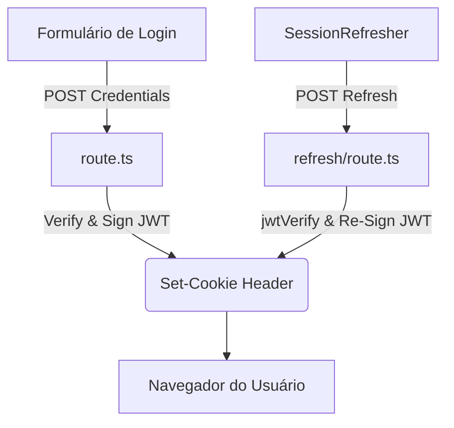

# 📁 API de Autenticação (BFF)

> **Versão da Documentação:** 1.1.0  
> **Última Atualização:** 2026-06-23  
> **Status:** Ativo

---

## 🎯 Visão Geral (The Blueprint)

Este diretório faz parte da camada BFF (*Backend-For-Frontend*) da aplicação, atuando como o intermediário seguro entre a interface do usuário e o gerenciamento de credenciais. A responsabilidade arquitetural deste módulo é blindar o ecossistema do cliente contra injeções de tokens (XSS) e gerenciar a temporalidade da sessão (expiração absoluta e renovação contínua).

Ao contrário de uma aplicação monolítica comum, esta rota roda nativamente na Borda da infraestrutura (Edge Runtime) garantindo uma performance e um isolamento criptográfico sem as latências pesadas do Node.js puro.

---

## 🏗️ Arquitetura e Fluxo de Dados

O fluxo é desenhado ao redor do padrão de **Zero-Token-Exposure**, onde o frontend nunca possui ou lê o token `JWT`. Em paralelo, o mecanismo de **Sliding Session** renova sessões ativas invisivelmente sem penalizar o usuário com deslogamentos precoces.

* **Entrada (Login):** Requisição HTTP POST contendo credenciais (`username`, `password`) e a intenção de longa duração (`rememberMe`).
* **Processamento:** Geração do `JWT` com o claim `origIat` para controle rígido de segurança (Hard Limit).
* **Entrada (Refresh):** Polling a cada 10 min disparado pelo `SessionRefresher` validando o token prévio.
* **Saída:** Retorno do cabeçalho de resposta contendo o `Set-Cookie` injetado diretamente no navegador do usuário, contendo flags `HttpOnly`, `Secure` e `SameSite=Strict`.

---

## 🗂️ Mapeamento de Componentes

### 📂 Subdiretórios

#### `📂 refresh/`
* **Responsabilidade:** Isolar a rota de renovação de sessão do endpoint oficial de emissão primária de autenticação.
* **Contrato/Interface:** Aceita `POST` sem corpo (body). Exige que o cookie da sessão atual seja encaminhado pelo navegador, devolvendo na resposta HTTP um cookie novo validado e com prazo renovado.

---

### 📄 Arquivos Chave

#### `📄 route.ts`
* **Responsabilidade:** Ponto central de emissão. Intercepta requisições de login, valida credenciais iniciais, injeta a data inicial no token (`origIat`) e assina o JWT via biblioteca nativa Web Crypto.
* **Principais Funções/Classes:**
    * `POST(request)`: Trata os dados do usuário com checagens de validação estritas contra injeção e gerencia tempos diferentes caso a checkbox *Lembrar de Mim* seja ativada.
* **Dependências Críticas:** `jose` (assinatura de tokens de alta performance compatível com ambiente Edge).

#### `📄 refresh/route.ts`
* **Responsabilidade:** Valida o JWT do cookie em andamento da sessão e emite um novo token. Contém a trava de limite absoluto (Absolute Timeout) da sessão para barrar o uso infinito de tokens ativos.
* **Principais Funções/Classes:**
    * `POST(request)`: Interpreta o cookie `educampo_session`. Verifica o claim de expiração e reinjeta o token com limite ajustado.

---

## 🧠 Decisões de Design & Trade-offs

* **Decisão:** Uso da biblioteca `jose` ao invés da tradicional `jsonwebtoken`.
* **Motivo:** O Vercel Edge Runtime é enxuto e não suporta integralmente os módulos nativos do Node `crypto`. A `jose` baseia-se na nativa Web Crypto API garantindo compatibilidade imediata com execuções Serverless leves.
* **Decisão:** Inclusão de `origIat` (Original Issued At) para *Absolute Timeout* na *Sliding Session*.
* **Motivo:** Sessões deslizantes, por regra de segurança, não podem renovar-se eternamente (evitando tokens sequestrados vivos `ad aeternum`). O limite rígido corta o refresh após um ciclo de horas (8h) ou dias (7d).
* **Decisão:** Omissão de Rate Limiting interno de código.
* **Trade-off:** Risco teórico de abuso de processamento em rotas desprotegidas, mitigável repassando essa responsabilidade para a camada WAF (Web Application Firewall) do provedor de hospedagem, poupando overhead da aplicação.

---

## 🧪 Estratégia de Testes

* **Tipo de Teste dominante:** Testes Comportamentais (Black-Box Testing) usando `Jest` no diretório `/tests/security/`.
* **Cenários Críticos:** 
  * Assegurar categoricamente a não-utilização de `localStorage` para tokens.
  * Verificar a presença das chaves de injeção de cookie `HttpOnly`.
  * Validar a blindagem das durações (expiração curta 15m vs longa 7d).
* **Estratégia de Mocking:** O Framework Next é mockado via `NextResponse` para auditar manualmente os atributos dos cabeçalhos das respostas.

---

## Related Context
- [[template_doc_diretorio]]