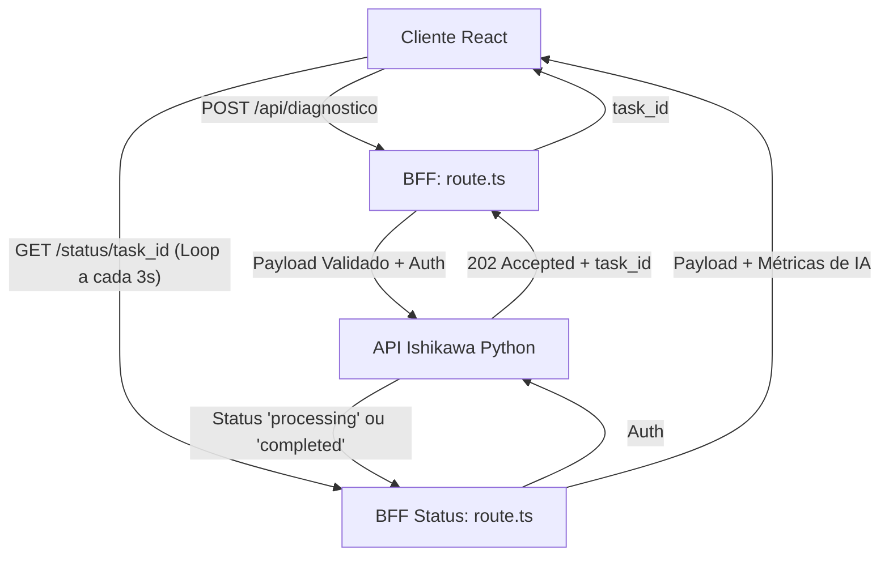

---

# 📁 API de Diagnóstico (BFF Ishikawa)

> **Versão da Documentação:** 2.0.0  
> **Última Atualização:** 2026-06-19  
> **Status:** Ativo

---

## 🎯 Visão Geral (The Blueprint)
Este diretório atua como um **Backend-For-Frontend (BFF)** focado estritamente na orquestração da geração de diagnósticos zootécnicos via Inteligência Artificial. Sua responsabilidade arquitetural principal é isolar a complexidade de autenticação, sanitização e comunicação assíncrona com o motor de Machine Learning (API em Python).

A partir da versão 2.0.0, este módulo abandonou o processamento síncrono para adotar o padrão de mensageria **Long Polling**, suportando a arquitetura baseada em Celery/Redis da API externa. Ele previne que o navegador ou proxies da web (ex: Cloudflare) cortem a conexão devido a *timeouts* durante processamentos pesados do LLM.

---

## 🏗️ Arquitetura e Fluxo de Dados
Os dados fluem através de um processo de enfileiramento e verificação de status iterativa (Polling):

* **Entrada:** Requisições HTTP (POST e GET) oriundas da tela de Carregamento (`page.tsx`), contendo dados da fazenda e requisições subsequentes de acompanhamento de status.
* **Transformação:** Validação de segurança via *Zod Schema*, mapeamento de chaves de dados do formato de front-end para o padrão Pydantic, e injeção do cabeçalho de autenticação (Bearer Token).
* **Saída:** O gatilho inicial devolve um `HTTP 202 Accepted` com um `task_id`. A rota de polling extrai as métricas de tokens/custos da IA (`X-IA-*`) injetando-os de forma transparente no payload de resposta quando `status === 'completed'`.

---

## 🗂️ Mapeamento de Componentes

### 📂 Subdiretórios

#### `📂 status/`
* **Responsabilidade:** Isolar as rotas dinâmicas responsáveis pelo acompanhamento de tarefas assíncronas do diagnóstico.
* **Contrato/Interface:** Expõe um endpoint dinâmico REST `GET /status/[task_id]` consumido exclusivamente em segundo plano pela interface de carregamento do usuário.

---

### 📄 Arquivos Chave

#### `📄 route.ts`
* **Responsabilidade:** Atuar como o gatilho (Trigger) inicial de submissão do diagnóstico, enviando o payload da fazenda para a fila de processamento da API Python.
* **Principais Funções/Classes:**
* `POST(req: NextRequest)`: Função que captura o corpo da requisição, aplica a validação Zod (`fazendaSchema`), formata as propriedades (ex: `mao_obra_total` para `numero_trabalhadores`), injeta as credenciais (`API_TOKEN`) e retorna o status `202 Accepted` junto com o `task_id`.
* **Dependências Críticas:** Depende do esquema `fazendaSchema` de `@/lib/schemas` para evitar Injeção de Dados ou Payloads Malformados antes de expor a API Python.

#### `📄 status/[task_id]/route.ts`
* **Responsabilidade:** Rota de Polling que faz proxy da requisição de status, enriquecendo e sanitizando a resposta final.
* **Principais Funções/Classes:**
* `GET(req: NextRequest, { params })`: Extrai o `task_id`, faz o bypass da autenticação para a API Externa. Quando o processamento atinge `completed`, extrai as métricas de tokens e custos dos *Headers HTTP* (ex: `X-IA-Custo-Dolar`) e as repassa estruturadas no objeto `ia_metrics`.

---

## 🧠 Decisões de Design & Trade-offs

* **Decisão:** Uso da arquitetura de Long Polling com rotas separadas (`POST` para envio, `GET` para status) no lugar de WebSockets.
* **Motivo:** O Vercel Edge Runtime e as restrições nativas do Next.js tornam o gerenciamento de conexões persistentes de WebSocket frágil e custoso de escalar, enquanto o modelo Request/Reply iterativo se encaixa perfeitamente no *fetch* e na resiliência HTTP tradicional.
* **Trade-off / Débito Técnico:** Maior volume de requisições de rede (*overhead*) transitando pelo BFF durante o laço `while`. Foi mitigado através de um timer de espaçamento rígido de 3 segundos implementado exclusivamente do lado do cliente (`page.tsx`).

* **Decisão:** Ocultação (Proxying) das credenciais de IA no BFF.
* **Motivo:** Jamais expor o `API_TOKEN` e a `API_BASE_URL` no navegador do usuário, prevenindo o uso abusivo do backend Python por terceiros não autorizados.

---

## 🧪 Estratégia de Testes

* **Tipo de Teste dominante:** Testes unitários com interceptação de rede via Jest localizados em `tests/api/bff.spec.ts` e `tests/api/status_bff.spec.ts`.
* **Cenários Críticos:** 
  - Bloqueio imediato (HTTP 400) se o Zod Schema falhar, sem queimar os recursos de rede.
  - Comportamento de repasse idêntico das falhas de Gateway (`502`, `504`) vindas da API Externa para que o front-end possa engatilhar seus *retries*.
* **Estratégia de Mocking:** O objeto nativo `global.fetch` do NodeJS é interceptado e substituído pelo `jest.fn()` para isolar a suíte da rede real, validando o comportamento de injeção segura de dependências (Headers / Auth) da rota.