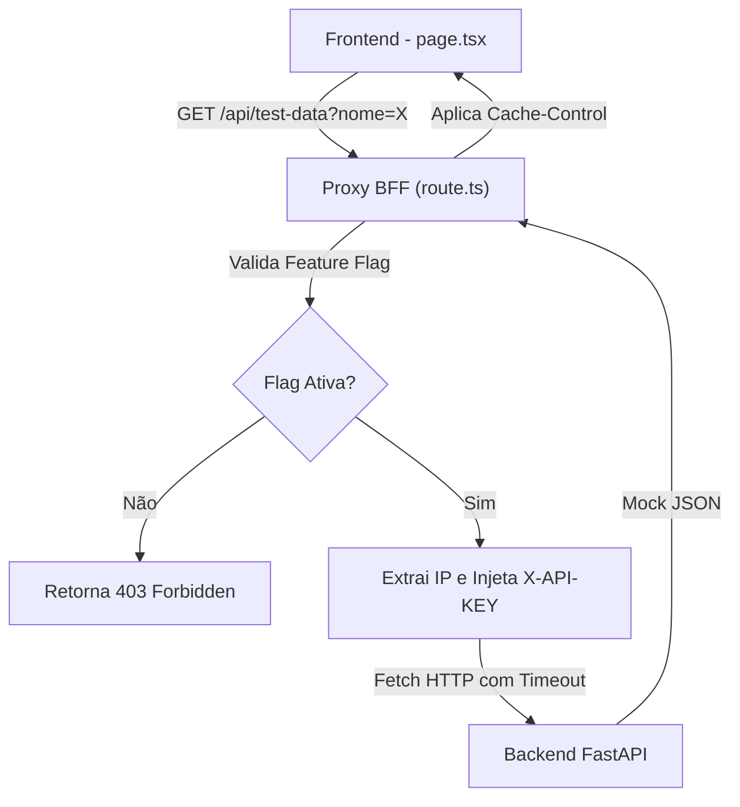

# 📁 src/app/api/test-data

> **Versão da Documentação:** 1.0.0  
> **Última Atualização:** 2026-06-22  
> **Status:** Ativo

---

## 🎯 Visão Geral (The Blueprint)

Este diretório contém a lógica do Proxy BFF (Backend For Frontend) para as rotas de consumo de mock data (Fazendas de Teste). Sua principal responsabilidade arquitetural é isolar e proteger os tokens de autenticação da aplicação (`X-API-KEY`) que não devem ser expostos ao lado cliente (navegador). Ele intercepta as requisições oriundas da interface de Coleta de Dados (apenas em ambiente de desenvolvimento) e as repassa de forma segura para a API FastAPI do backend.

---

## 🏗️ Arquitetura e Fluxo de Dados

O fluxo ocorre para viabilizar o preenchimento automático do formulário com perfis imutáveis de testes:
1. O componente de UI (`page.tsx` no `/formulario`) dispara uma requisição GET ao Proxy.
2. O Proxy intercepta a chamada, valida as configurações (`Guard Clauses` e `Feature Flags`), extrai o IP real do cliente para não violar as regras de *Rate Limiting* do backend.
3. O Proxy injeta a chave secreta (`API_TOKEN`) e um limite de timeout na requisição (Fail-fast).
4. A resposta em JSON ou o erro são devolvidos com cabeçalhos de Caching para a UI.

---

## 🗂️ Mapeamento de Componentes

### 📄 Arquivos Chave

#### `📄 route.ts`

* **Responsabilidade:** Único handler da rota de API de desenvolvimento. Atua como Middleman/BFF.
* **Principais Funções/Classes:**
    * `GET`: Função nativa do Next.js App Router para interceptar chamadas HTTP GET. Trata tanto a listagem geral de fazendas (sem query params) quanto a busca por uma fazenda específica (via `?nome=X`). Implementa medidas estritas de segurança (ocultação de API keys, Rate Limiting repasse de IP e timeouts).
* **Dependências Críticas:** Depende diretamente do arquivo raiz `.env` para adquirir as chaves `API_BASE_URL`, `API_TOKEN` e a chave de feature `NEXT_PUBLIC_ENABLE_TEST_FARMS`.

---

## 🧠 Decisões de Design & Trade-offs

* **Decisão:** Uso do padrão BFF (Proxy Interno do Next.js) em vez de client-side fetching direto para a API Python.
* **Motivo:** Evita a exposição da `X-API-KEY` (secret) aos usuários/inspetores de rede do navegador, garantindo que o backend confie em quem está solicitando os dados sensíveis da API.
* **Trade-off / Débito Técnico:** Aumenta ligeiramente a latência por introduzir mais um "hop" de rede e consumo de recursos no servidor do Next.js (Edge/Node) ao repassar requisições.

* **Decisão:** Repasse obrigatório do cabeçalho `X-Forwarded-For`.
* **Motivo:** O backend aplica Rate Limit (proteção contra DoS). Sem esse cabeçalho, o backend identificaria todas as requisições como oriundas do próprio servidor Next.js, bloqueando a aplicação inteira em caso de tráfego massivo.

---

## 🧪 Estratégia de Testes

Este módulo de roteamento é testado de forma robusta e isolada.

* **Tipo de Teste dominante:** Testes unitários com Jest e classes `NextRequest/NextResponse` simuladas.
* **Cenários Críticos:** 
  1. Garantir que o `X-API-KEY` seja inserido nos headers da chamada final.
  2. Retornar dados completos quando o `nome` é informado, ou a lista parcial (base) se omitido.
  3. Lidar gracefully com falhas 500 originadas pelo backend FastAPI sem gerar exceptions brutas no frontend.
* **Estratégia de Mocking:** O método global `fetch` foi completamente interceptado (`global.fetch = jest.fn()`) para validar os payloads, rotas e headers formados pelo BFF, devolvendo objetos estáticos sintéticos.

---

## Related Context

* [[2026-06-19-mock-data-routes-integration]]
* [[2026-06-19-test-endpoints-mock-data-architecture]]
