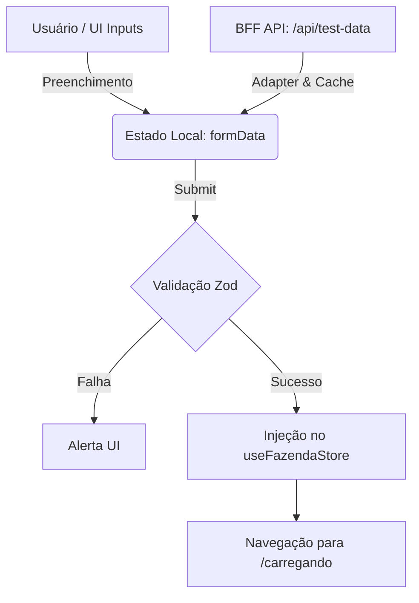

# 📁 Módulo de Coleta de Dados (`/app/formulario`)

> **Versão da Documentação:** 1.1.0  
> **Status:** Ativo

---

## 🎯 Visão Geral (The Blueprint)

Este diretório contém a interface primária do sistema: o **Formulário de Coleta de Dados** operacionais e zootécnicos da fazenda. A responsabilidade arquitetural deste módulo é atuar como o portal seguro de entrada de dados, isolando o estado global (Zustand) de interações e inputs brutos. Ele higieniza e valida todas as interações do usuário, garantindo que apenas dados compatíveis e pré-processados avancem para o motor de Diagnóstico. Adicionalmente, possui integração assíncrona com proxies (BFF) para injeção de dados de mock voltados ao ambiente de desenvolvimento.

---

## 🏗️ Arquitetura e Fluxo de Dados

O componente segue um fluxo de dado unidirecional em produção, expandido por uma malha assíncrona de I/O em desenvolvimento (Mock Data).

* **Entrada:** Inputs diretos do DOM nativo via eventos React. Em ambiente de DEV, a entrada também advém de chamadas `fetch` à rota BFF (`/api/test-data`).
* **Transformação & Adapter:** Os dados recebidos da API de Mock são adaptados estruturalmente por uma função pura (`mapFarmApiToFormData`) e temporariamente mantidos em um *Cache Local* (`useRef`) para prevenção de _round-trips_ redundantes.
* **Saída:** Objeto purificado via *Schema Zod*, despachado para a camada de gerenciamento de estado global (`useFazendaStore`) e redirecionamento via `useRouter`.

---

## 🗂️ Mapeamento de Componentes

### 📄 Arquivos Chave

#### `📄 page.tsx`

* **Responsabilidade:** Componente visual principal e controlador do formulário. Centraliza o gerenciamento de eventos, chamadas de rede isoladas para DEV, validação form-level e integração com o Zustand.
* **Principais Funções/Interfaces:**
    * `TestFarmApiResponse` & `TestFarmListItem`: Contratos TypeScript estritos para I/O com o BFF.
    * `mapFarmApiToFormData`: Implementação pura do padrão Adapter. Faz a "tradução" do domínio aninhado da API para o estado plano do formulário.
    * `handleTestFarmChange`: Manipulador que gerencia cache local de fazendas e requisições HTTP para facilitar o preenchimento automático.
    * `handleSubmit`: Orquestrador de validação `z.coerce` e *dispatch* para a store global.
* **Dependências Críticas:** Fortemente acoplado ao `fazendaSchema` (`@/lib/schemas`) para validação e ao `useFazendaStore` para passagem do bastão funcional.

---

## 🧠 Decisões de Design & Trade-offs

* **Decisão:** Extração da lógica "De-Para" da API de Mock para a função pura `mapFarmApiToFormData`.
* **Motivo:** O objeto recebido do BFF possui uma estrutura aninhada (em `"dados": {}`) incompatível com o estado interno do formulário. O padrão Adapter garante que o componente consuma os dados no seu próprio dialeto, respeitando o princípio de responsabilidade única (SRP).
* **Trade-off / Débito Técnico:** Componentes UI normalmente não deveriam orquestrar lógica complexa de mapeamento; idealmente isso caberia a uma camada de serviço front-end. O acoplamento dentro do mesmo arquivo atende à simplicidade, mas exige manutenção sincronizada caso a estrutura do formulário cresça.

* **Decisão:** Uso de `useRef` para caching local das fazendas.
* **Motivo:** Evita *round-trips* redundantes na rede caso o desenvolvedor alterne repetidamente a fazenda de testes no `<select>`.
* **Trade-off / Débito Técnico:** Aumenta ligeiramente o *footprint* de memória em troca de redução no tráfego de rede para a mesma sessão ativa de um componente local, em vez de delegar essa responsabilidade para bibliotecas especialistas como React Query.

---

## 🧪 Estratégia de Testes

* **Tipo de Teste dominante:** Testes Unitários/Integração UI com Jest e `@testing-library/react`.
* **Cenários Críticos:** 
  * Validação cruzada (Zod) garantindo que vacas em lactação nunca excedam o tamanho total do rebanho, independentemente das artimanhas do HTML5.
  * Injeção simulada (Mocking) da função de roteamento `next/navigation` e da manipulação de estado global (Zustand).
* **Estratégia de Mocking:** O *fetch* nativo é interceptado e sobrescrito (`global.fetch = jest.fn()`) no escopo da suite para retornar um contrato idêntico ao do servidor, permitindo validação das mecânicas do Adapter sem incorrer em acoplamento de rede nos testes unitários.
